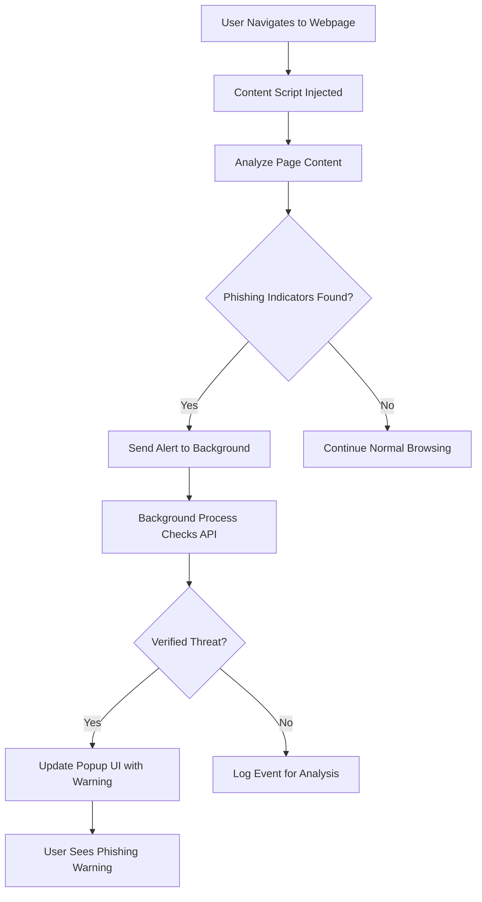

# AntiPhishing Chrome Extension

## Overview
The AntiPhishing Chrome Extension is designed to detect phishing attempts by monitoring web pages and analyzing suspicious patterns in URLs and content. It serves as a robust network security tool intended for protecting users by alerting them to potential phishing threats. The extension largely meets its goal by offering real-time detection and alerting mechanisms, although there are areas that can be further optimized.

## Goals and Performance
- **Primary Goal:** To provide an efficient anti-phishing mechanism for Chrome users through real-time analysis and alerting.
- **Performance:** The tool successfully identifies potential phishing attempts. However, it encounters performance issues under heavy DOM loads and might produce occasional false positives.

## Issues Encountered
- **Background Process Stability:** Challenges in maintaining persistent event listeners in `src/background.ts` under heavy load conditions.
- **Content Script Efficiency:** The `src/content.ts` script sometimes struggles with performance on pages with complex or rapidly changing content.
- **Build Process Complications:** Initial configuration of `webpack.config.js` required fine-tuning to properly bundle TypeScript (`.ts`) and TSX (`.tsx`) files.
- **UI Responsiveness:** The user interface defined in `src/popup.tsx` occasionally faces rendering issues on older Chrome versions.

## Strengths and Weaknesses
### Strengths
- **Real-time Phishing Detection:** Quickly identifies and alerts users to suspected phishing activities.
- **Modular Architecture:** Clear separation between background processes, content analysis, and user interface components.
- **Modern Codebase:** Utilizes TypeScript and React (in popup) for improved maintainability and scalability.

### Weaknesses
- **False Positives:** The detection algorithm can mistakenly flag legitimate websites as suspicious.
- **Performance Bottlenecks:** Especially in scenarios with heavy or dynamic webpage content.
- **Limited Logging:** More comprehensive logging would aid troubleshooting and performance tuning.

## Description of the Tool's Operation

The extension operates by injecting a content script (`src/content.ts`) into active web pages. This script analyzes page content to locate elements indicative of phishing. Simultaneously, the background script (`src/background.ts`) monitors network requests and manages inter-process communications between tabs and the popup UI. All source files are bundled using webpack, ensuring compatibility with Chrome’s extension architecture.

## Code Documentation and Main Components
- **manifest.json:** Defines essential metadata, permissions, and configurations required by the Chrome extension.
- **src/background.ts:** Contains the background logic for handling asynchronous events, monitoring network activities, and coordinating with other extension components.
- **src/content.ts:** Deployed on web pages to gather data on potential phishing content and send relevant information back to the background process.
- **src/popup.tsx:** Implements the interactive popup UI that users can access to view alerts and information. This component is built using React and TypeScript.
- **webpack.config.js:** Responsible for bundling and processing the different source files, ensuring that all modules work together seamlessly.

Each code module includes inline comments and JSDoc-style documentation to explain functionality, making the codebase easier to understand and maintain for future development.

## Conclusion
The AntiPhishing Chrome Extension is a well-constructed tool that effectively addresses phishing risks in real-time. While it has demonstrated success in meeting its primary objectives, continuous improvements in performance, false positive reduction, and UI responsiveness are essential for future iterations.

_Last updated on 2025-02-02_
